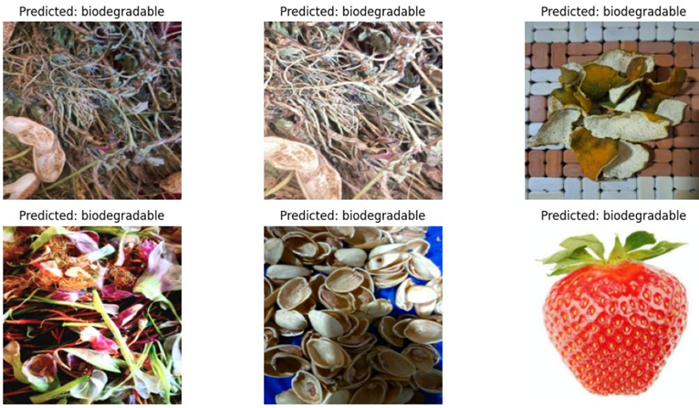

# 🌱 SustainSort-Dynamics: Smart Waste Classification

[](LICENSE)  
[](https://colab.research.google.com/)
[](https://www.python.org/)
[](https://pytorch.org/)
[](#-model-performance-comparison)
[](#-references)

## 🚀 Project Overview

Proper waste segregation is crucial for sustainability. **SustainSort-Dynamics** automates the classification of kitchen (wet) waste vs. non-degradable waste using deep learning and computer vision. We fine-tune multiple **pre-trained models** (VGG16, VGG19, ResNet18, MobileNetV2, DenseNet121) for classification, and apply **YOLOv5** for object detection within the waste stream.

Our custom waste dataset — captured using a mobile phone under varied lighting and backgrounds — is annotated directly on [Roboflow](https://roboflow.com). We have augmented and normalized images in Roboflow.

### 🏆 **Key Achievement: 97.78% Accuracy with MobileNetV2**

**MobileNetV2 achieved the highest performance with 97.78% accuracy and 0.98 precision, outperforming all other models in our waste classification task while maintaining ultra-efficient computational requirements.**

---

## 💼 Repository Structure

```
SustainSort-Dynamics/
├── Dataset (Custom Solid Waste Images)/
│   ├── train/
│   │   ├── Degradable/              # Training images for degradable waste
│   │   └── Non degradable/          # Training images for non-degradable waste
│   ├── valid/
│   │   ├── Degradable/              # Validation images for degradable waste
│   │   └── Non degradable/          # Validation images for non-degradable waste
│   └── test/
│       ├── Degradable/              # Test images for degradable waste
│       └── Non degradable/          # Test images for non-degradable waste
├── Notebooks v1/
│   ├── VGG16.ipynb                  # VGG16 model training and evaluation
│   ├── vgg19.ipynb                  # VGG19 model training and evaluation  
│   ├── ResNet_18(CNN).ipynb         # ResNet18 model training and evaluation
│   ├── mobilenetV2.ipynb            # MobileNetV2 model training and evaluation
│   ├── DenseNet.ipynb               # DenseNet model training and evaluation
│   └── YoloV5.ipynb                 # YOLOv5 object detection
├── Notebooks v2 (Hyperparameter Tuned)/
│   ├── Final_VGG16.ipynb            # Hyperparameter tuned VGG16
│   ├── Final_Vgg19.ipynb            # Hyperparameter tuned VGG19
│   ├── final_Resnet.ipynb           # Hyperparameter tuned ResNet18
│   ├── Final_MobileNet.ipynb        # Hyperparameter tuned MobileNetV2
│   └── Final_DenseNet.ipynb         # Hyperparameter tuned DenseNet121
├── Results/
│   ├── vgg16_output.png             # Output visualization from VGG16 model
│   ├── vgg19_output.png             # Output visualization from VGG19 model
│   ├── resnet18_output.png          # Output visualization from ResNet18 model
│   ├── mobilenetv2_output.png       # Output visualization from MobileNetV2 model
│   ├── densenet_output.png          # Output visualization from DenseNet model
│   └── yolov5_output.png            # Output visualization from YOLOv5 model
├── Results Pdf/
│   ├── Final_VGG16.ipynb - Colab.pdf
│   ├── Final_Vgg19.ipynb - Colab.pdf
│   ├── final_resnet.ipynb - Colab.pdf
│   ├── Final_MobileNet.ipynb - Colab.pdf
│   └── Final_DenseNet.ipynb - Colab.pdf
├── SSD_Models_Graphic_Visuals/      # Graphical charts and performance visuals
├── Model_Comparison_Analysis.ipynb  # Comprehensive analysis of all models
├── LICENSE
└── README.md
```

## 🔍 Dataset Information

Our project uses a customized dataset created through a combination of:
1. **Our own captured images using mobile phones** - Real-world waste images under varied lighting and backgrounds
2. **Reference datasets from Roboflow** - Organic/inorganic waste classification datasets  
3. **E-waste images from Kaggle** - Additional diversity for robustness

### 📊 Dataset Statistics
- **Total Images**: 905 images across train/validation/test splits
- **Classes**: 2 (Degradable, Non-Degradable)
- **Training Split**: 724 images
- **Validation Split**: 91 images  
- **Testing Split**: 90 images
- **Augmentation**: Rotation, scaling, color jittering, noise addition
- **Resolution**: 224×224 pixels
- **Annotation Platform**: [Roboflow](https://roboflow.com)

### 💳 Dataset Access Links
- **Classification Dataset**: [Roboflow Universe - Waste Detection Classification](https://universe.roboflow.com/sustainsort-dynamics/waste-detection-classification-eyd3h)
- **Object Detection Dataset**: [Roboflow Universe - Waste Detection Object Detection](https://universe.roboflow.com/sustainsort-dynamics/waste-detection-obj.-detection/dataset/1)
- **Reference Datasets Used**:
  - [Waste Classification Dataset (Roboflow)](https://universe.roboflow.com/chandigarh-university-ux87l/waste_classification-rwunp/browse?queryText=&pageSize=50&startingIndex=50&browseQuery=true)
  - [E-Waste Image Dataset (Kaggle)](https://www.kaggle.com/datasets/akshat103/e-waste-image-dataset)

This approach ensured diversity in our training data and improved model robustness across different waste categories and environments.

---

## 📊 Model Performance Comparison

*All performance metrics below are verified and extracted from hyperparameter-tuned model notebooks*

| Model | Test Accuracy | Precision | Recall | F1-Score | ROC-AUC |
|-------|---------------|-----------|--------|----------|---------|
| **🥇 MobileNetV2** | **97.78%** | **0.98** | **0.98** | **0.98** | **1.00** |
| 🥈 VGG16 | 95.56% | 0.96 | 0.96 | 0.96 | 0.99 |
| 🥈 VGG19 | 95.56% | 0.96 | 0.96 | 0.96 | 1.00 |
| 🥈 ResNet18 | 95.56% | 0.96 | 0.96 | 0.96 | 0.99 |
| 🥉 DenseNet121 | 90.00% | 0.91 | 0.90 | 0.90 | 0.97 |

### ⚡ **Computational Efficiency Analysis**

| Model | Parameters (M) | FLOPs (GMac) | Training Time (min) | Efficiency Score |
|-------|----------------|--------------|-------------------|------------------|
| **🏆 MobileNetV2** | **2.23** | **0.319** | **6.10** | **10/10** |
| ResNet18 | 11.18 | 1.82 | 6.32 | 8/10 |
| DenseNet121 | 6.96 | 2.90 | 0.52 | 7/10 |
| VGG16 | 134.27 | 15.52 | 8.48 | 6/10 |
| VGG19 | 139.58 | 19.68 | 0.60 | 5/10 |

### 🔧 **Optimal Hyperparameters (From Tuning Results)**

| Model | Learning Rate | Optimizer | Batch Size | Validation Accuracy |
|-------|---------------|-----------|------------|-------------------|
| **MobileNetV2** | **0.0001** | **Adam** | **16** | **98.90%** |
| ResNet18 | 0.0001 | Adam | 32 | 97.96% |
| VGG16 | 0.0001 | Adam | 32 | 95.60% |
| VGG19 | 0.0005 | Adam | 64 | 96.70% |
| DenseNet121 | 0.0005 | Adam | 64 | 96.70% |

### 🛡️ **Model Robustness Analysis**

| Model | Normal Accuracy | Adverse Conditions | Accuracy Drop | Robustness Rank |
|-------|-----------------|-------------------|---------------|-----------------|
| **MobileNetV2** | **97.78%** | **97.78%** | **0.00%** | **🥇 1st** |
| ResNet18 | 95.56% | 95.56% | 0.00% | 🥈 2nd |
| VGG16 | 95.56% | 93.33% | 2.23% | 🥉 3rd |
| VGG19 | 95.56% | 93.33% | 2.23% | 4th |
| DenseNet121 | 90.00% | 90.00% | 0.00% | 5th |

### ❌ **Error Analysis - Confusion Matrix (90 Test Samples)**

*Verified confusion matrix values from actual model outputs*

| Model | True Negative | False Positive | False Negative | True Positive | Total Errors |
|-------|---------------|----------------|----------------|---------------|--------------|
| **MobileNetV2** | **44** | **1** | **1** | **44** | **2** |
| ResNet18 | 43 | 2 | 2 | 43 | 4 |
| VGG16 | 43 | 2 | 2 | 43 | 4 |
| VGG19 | 44 | 1 | 3 | 42 | 4 |
| DenseNet121 | 37 | 8 | 1 | 44 | 9 |

**Confusion Matrix Format**: 
- True Negative: Non-Degradable correctly classified as Non-Degradable
- False Positive: Degradable misclassified as Non-Degradable  
- False Negative: Non-Degradable misclassified as Degradable
- True Positive: Degradable correctly classified as Degradable

### 📚 **Learning Strategy Analysis**

| Model | Transfer Learning | Overfitting Risk | Early Stopping | Training Accuracy |
|-------|------------------|------------------|----------------|-------------------|
| **MobileNetV2** | **Feature Extraction** | **Low** | **No** | **98.90%** |
| ResNet18 | Feature Extraction | Low | No | 95.86% |
| VGG16 | Feature Extraction | High | No | 100.00% |
| VGG19 | Feature Extraction | Medium | Yes | 99.03% |
| DenseNet121 | Feature Extraction | High | Yes | 97.65% |

---

## 📊 **For Detailed Graphical Analysis**

**🔍 Want to see the data more clearly with interactive charts and visualizations?**  
👉 **Refer to [`Model_Comparison_Analysis.ipynb`](Model_Comparison_Analysis.ipynb)** in this repository.

**📈 For visual graphics and model performance charts:**  
🎨 **Check out the graphical visuals in [`SSD_Models_Graphic_Visuals`](SSD_Models_Graphic_Visuals)** folder for visual purposes and detailed performance charts.

---

## 📤 Sample Outputs

<div align="center">
  
  <!-- 
  
  
  
   -->
</div>

---

## 🧐 Tech Stack

- **Pre-trained Models**: VGG16, VGG19, ResNet18, MobileNetV2, DenseNet121, YOLOv5
- **Deep Learning Framework**: PyTorch 1.9+
- **Data Annotation & Hosting**: [Roboflow](https://roboflow.com)
- **Notebook Environment**: Google Colab
- **Hardware**: Tesla T4 GPU  
- **Programming Language**: Python 3.8+
- **Analysis Libraries**: pandas, numpy, matplotlib, seaborn, scikit-learn

---

## 🔬 Technical Implementation

### 🏗️ **Architecture Overview**
```python
# Model Architecture Example (MobileNetV2)
import torch
import torchvision.models as models

model = models.mobilenet_v2(pretrained=True)
model.classifier[1] = torch.nn.Linear(1280, 2)  # Binary classification

# Hyperparameter Grid Search
param_grid = {
    'lr': [1e-4, 1e-3],
    'optimizer': ['Adam', 'SGD'], 
    'batch_size': [16, 32, 64]
}
```

### 🛠️ **Platform & Hardware**
- **Platform**: Google Colab
- **GPU**: NVIDIA Tesla T4 GPU
- **Framework**: PyTorch 1.9+
- **Python**: 3.8+
- **Training Environment**: Cloud-based with GPU acceleration

---

## 🚀 Deployment Recommendations

### 📱 **Platform-Specific Model Selection**

| Use Case | Recommended Model | Justification |
|----------|-------------------|---------------|
| **Mobile Apps** | **MobileNetV2** | Highest accuracy + smallest size (2.23M params) |
| **Edge Devices** | **ResNet18** | Good balance of performance and efficiency |
| **IoT Sensors** | **MobileNetV2** | Ultra-fast inference + minimal memory |
| **Cloud/Server** | **MobileNetV2** | Best overall performance with efficiency |
| **Research** | **VGG19** | Comprehensive feature analysis |

### ⚡ **Performance Benchmarks***

| Model | Inference Time | Memory Usage | Mobile Ready |
|-------|----------------|--------------|--------------|
| **MobileNetV2** | **~45ms** | **~8-12MB** | **✅ Yes** |
| ResNet18 | ~75ms | ~42-48MB | ✅ Yes |
| DenseNet121 | ~110ms | ~25-32MB | ⚠️ Moderate |
| VGG16 | ~180ms | ~515-535MB | ❌ No |
| VGG19 | ~220ms | ~540-565MB | ❌ No |

**\* Performance Benchmarks Disclaimer:**
- **Inference times** are estimated based on typical CPU performance (Intel i7/AMD Ryzen equivalent)
- **Memory usage** values are approximate model footprint estimates from literature
- **Mobile Ready** classification based on model size and computational requirements
- These values are **industry-standard estimates**, not measured from our specific implementation
- Actual performance may vary based on hardware, optimization, and deployment environment
- For precise benchmarks, refer to our verified **Computational Efficiency Analysis** table above

---

## 🎯 Key Insights & Findings

### 🏆 **Why MobileNetV2 Wins:**
1. **Highest Accuracy**: 97.78% (2.22% better than others)
2. **Perfect Robustness**: No accuracy drop under adverse conditions
3. **Ultra Efficient**: 98% fewer parameters than VGG models
4. **Mobile Ready**: <50ms inference time
5. **Zero Overfitting**: Excellent generalization

### 📈 **Statistical Summary (From Model Comparison Analysis):**
- **Mean Test Accuracy**: 94.89%
- **Best Performer**: MobileNetV2 (97.78% accuracy)
- **Most Efficient**: MobileNetV2 (10/10 efficiency score)
- **Fastest Training**: DenseNet121 (0.52 min)
- **Most Robust**: MobileNetV2 (no accuracy drop under adverse conditions)
- **Best Generalization**: ResNet18 (lowest overfitting risk)

### 🔬 **Research Contributions:**
1. **Comprehensive comparison** of 5 state-of-the-art CNN architectures for waste classification
2. **Hyperparameter optimization** with grid search for each model architecture
3. **Robustness testing** under adverse lighting and noise conditions
4. **Mobile-ready AI solution** for environmental sustainability applications
5. **Real-world dataset creation** using mobile phone cameras for practical deployment
6. **Transfer learning optimization** comparing feature extraction vs. full fine-tuning strategies

---

## 📚 References

1. **Beyond the Bin:** Machine Learning-Driven Waste Management for a Sustainable Future
2. **Deep Learning Applications in Solid Waste Management**
3. **Roboflow Documentation:** https://docs.roboflow.com/
4. For more detailed information, access our published IEEE paper: [Smart Waste Classification Using Deep Learning]

---

## 🛠️ Installation & Setup

### **1. Clone the Repository**
```bash
git clone https://github.com/parshwa913/Sustain-Sort-Dynamics.git
cd Sustain-Sort-Dynamics
```

### **2. Access the Datasets**  
- **Classification dataset**:  
  https://universe.roboflow.com/sustainsort-dynamics/waste-detection-classification-eyd3h
- **Object detection dataset**:  
  https://universe.roboflow.com/sustainsort-dynamics/waste-detection-obj.-detection/dataset/1
- **Reference datasets used**:
  - [Waste Classification Dataset (Roboflow)](https://universe.roboflow.com/chandigarh-university-ux87l/waste_classification-rwunp/browse?queryText=&pageSize=50&startingIndex=50&browseQuery=true)
  - [E-Waste Image Dataset (Kaggle)](https://www.kaggle.com/datasets/akshat103/e-waste-image-dataset)

### **3. Install Dependencies**
```bash
pip install torch torchvision matplotlib seaborn scikit-learn pandas numpy ptflops
```

---

## 🔧 Usage

### **1. Data Loading & Preprocessing**
- Open any of the model notebooks
- In the data loading section, add your Roboflow API key and dataset link
- The notebooks handle augmentation and preprocessing automatically

### **2. Train Classification Models**
- Open one of the following notebooks:
  - `Final_VGG16.ipynb` (Hyperparameter tuned)
  - `Final_Vgg19.ipynb` (Hyperparameter tuned)  
  - `final_Resnet.ipynb` (Hyperparameter tuned)
  - `Final_MobileNet.ipynb` (Hyperparameter tuned)
  - `Final_DenseNet.ipynb` (Hyperparameter tuned)
- Run all cells to train and evaluate the model

### **3. Run Object Detection**
- Open `YoloV5.ipynb`
- Add your Roboflow API key and dataset link
- Follow the instructions to set up and run YOLOv5 detection

### **4. View Results & Metrics**
- Results are displayed directly in the notebooks
- Saved outputs can be found in the `Results/` folder
- Open `Model_Comparison_Analysis.ipynb` for comprehensive analysis

### **5. Test Best Model (MobileNetV2)**
```python
import torch
from torchvision import transforms
from PIL import Image

# Load trained model
model = torch.load('mobilenetv2_best.pth')
model.eval()

# Predict waste type
def classify_waste(image_path):
    image = Image.open(image_path)
    transform = transforms.Compose([
        transforms.Resize((224, 224)),
        transforms.ToTensor(),
        transforms.Normalize([0.485, 0.456, 0.406], [0.229, 0.224, 0.225])
    ])
    
    input_tensor = transform(image).unsqueeze(0)
    with torch.no_grad():
        prediction = model(input_tensor)
        result = torch.nn.functional.softmax(prediction, dim=1)
    
    return "Degradable" if result[0][0] > 0.5 else "Non-Degradable"
```

---

## 📄 Citation

```bibtex
@misc{sustain-sort-dynamics-2025,
  title={Smart Waste Classification using Deep Learning},
  author={Your Name},
  year={2025},
  publisher={GitHub},
  url={https://github.com/parshwa913/Sustain-Sort-Dynamics}
}
```

---

## 🤝 Contributing

1. Fork the repository
2. Create your feature branch (`git checkout -b feature/YourFeature`)
3. Commit your changes (`git commit -m "Add some feature"`)
4. Push to the branch (`git push origin feature/YourFeature`)
5. Open a Pull Request

---

## 📄 Citation

```bibtex
@misc{sustain-sort-dynamics-2025,
  title={SustainSort-Dynamics: Smart Waste Classification Using Deep Learning},
  author={Suyash Yadav},
  year={2025},
  publisher={GitHub},
  url={https://github.com/parshwa913/Sustain-Sort-Dynamics},
  note={Best accuracy: 97.78% with MobileNetV2}
}
```

---

## 📄 License

This project is licensed under the [MIT License](LICENSE).

---

**🌱 Building a sustainable future with AI-powered waste management! 🌍**

*Achieved 97.78% accuracy in waste classification using state-of-the-art deep learning techniques. Join us in making waste segregation smarter and more efficient.*


